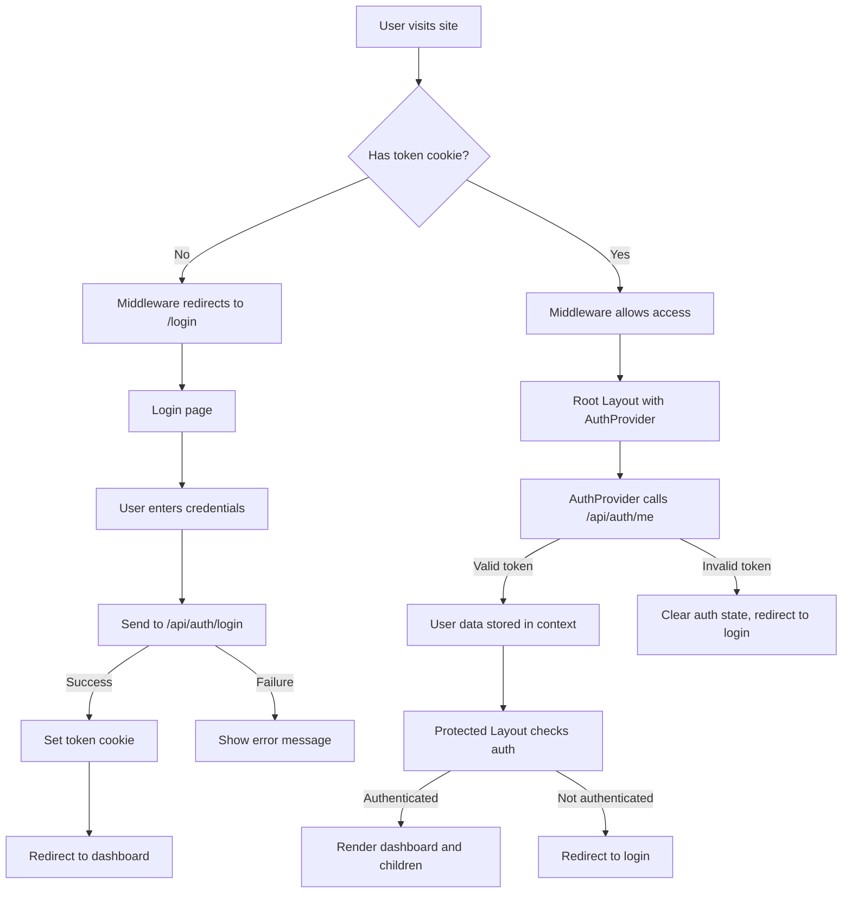

# Chaya App Frontend Development Guide

## Table of Contents

- [Chaya App Frontend Development Guide](#chaya-app-frontend-development-guide)
  - [Table of Contents](#table-of-contents)
  - [Project Overview](#project-overview)
    - [Key Features](#key-features)
    - [Tech Stack](#tech-stack)
  - [Architecture](#architecture)
    - [Frontend-Backend Communication](#frontend-backend-communication)
  - [Authentication Flow](#authentication-flow)
    - [Login Process](#login-process)
    - [Auth Verification](#auth-verification)
    - [Logout Process](#logout-process)
    - [Implementation](#implementation)
    - [Middleware for Route Protection](#middleware-for-route-protection)
  - [Frontend Structure](#frontend-structure)
    - [File/Folder Organization](#filefolder-organization)
    - [Key Pages and Components](#key-pages-and-components)
      - [Root Layout](#root-layout)
      - [Dashboard Layout](#dashboard-layout)
  - [Data Fetching Strategies](#data-fetching-strategies)
    - [Server Components](#server-components)
    - [Client Components](#client-components)
    - [Search and Pagination](#search-and-pagination)
  - [Form Handling](#form-handling)
  - [File Uploads with UploadThing](#file-uploads-with-uploadthing)
    - [Setup UploadThing in Next.js](#setup-uploadthing-in-nextjs)
    - [Handling Multiple Fields within a Form](#handling-multiple-fields-within-a-form)
  - [Role-Based Access Control](#role-based-access-control)
    - [Custom Hook for Permissions](#custom-hook-for-permissions)
- [Chaya App Frontend Development Guide (Continued)](#chaya-app-frontend-development-guide-continued)
  - [Role-Based Access Control (Continued)](#role-based-access-control-continued)
    - [Server-Side Role Checks](#server-side-role-checks)
  - [UI Components](#ui-components)
    - [Using shadcn/ui](#using-shadcnui)
      - [Installation](#installation)
      - [Creating a Data Table](#creating-a-data-table)
      - [Custom Pagination Component](#custom-pagination-component)
  - [Routing and Navigation](#routing-and-navigation)
    - [Page URLs and Structure](#page-urls-and-structure)
    - [Navigation Between Pages](#navigation-between-pages)
  - [State Management](#state-management)
    - [Setup React Query for Data Fetching](#setup-react-query-for-data-fetching)
  - [Error Handling](#error-handling)
    - [Global Error Handling](#global-error-handling)
    - [API Error Handling](#api-error-handling)
  - [Performance Optimization](#performance-optimization)
    - [Image Optimization](#image-optimization)
    - [React Server Components](#react-server-components)
    - [Suspense for Loading States](#suspense-for-loading-states)
  - [Common Patterns](#common-patterns)
    - [Custom Forms with React Hook Form and Zod](#custom-forms-with-react-hook-form-and-zod)
    - [Reusable Modal/Dialog](#reusable-modaldialog)
  - [Development Workflow](#development-workflow)
    - [Working with the Monorepo](#working-with-the-monorepo)
    - [Implementing New Features](#implementing-new-features)
- [Authentication Flow Clarification](#authentication-flow-clarification)
  - [Auth Provider](#auth-provider)
  - [Middleware](#middleware)
  - [Root Layout (`app/layout.tsx`)](#root-layout-applayouttsx)
  - [Dashboard Layout (`app/(dashboard)/layout.tsx`)](#dashboard-layout-appdashboardlayouttsx)
  - [Authentication Flow Diagram](#authentication-flow-diagram)
  - [Key Points to Remember](#key-points-to-remember)

## Project Overview

Chaya App is an internal dashboard tool for an NGO to manage farmers and their produce. The system enables tracking metrics, managing farmer data, and handling procurement and processing information.

### Key Features

- User authentication (Admin and Staff roles)
- Farmer management with detailed profiles
- Document uploads (profile pictures, Aadhar cards, bank documents)
- Field management for farmlands
- Data visualization and reporting
- Staff user management

### Tech Stack

- **Frontend**: Next.js (App Router), React, TypeScript
- **UI Components**: shadcn/ui
- **Backend**: Fastify with TypeScript
- **Database**: PostgreSQL with Prisma ORM
- **File Storage**: UploadThing
- **Monorepo Structure**: Turborepo with pnpm

## Architecture

The application follows a monorepo structure with shared types and schemas:

```
chaya-freelance/
├── apps/
│   ├── api/             # Fastify backend
│   └── web/             # Next.js frontend
├── packages/
│   └── shared/          # Shared code, Prisma schema, types
├── .env                 # Environment variables
└── turbo.json           # Turborepo configuration
```

### Frontend-Backend Communication

- The frontend communicates with the backend through API calls
- Authentication is managed via JWT tokens stored in HTTP-only cookies
- Server components fetch data directly using the Prisma client from shared package
- Client components use fetch API to make requests to backend endpoints

## Authentication Flow

### Login Process

1. User enters credentials on login page
2. Frontend sends credentials to `/api/auth/login` endpoint
3. Backend validates credentials, creates JWT token
4. Token is set as HTTP-only cookie
5. User information is returned and stored in auth context
6. User is redirected to dashboard

### Auth Verification

1. Next.js middleware checks for token cookie on protected routes
2. If token is missing, user is redirected to login page
3. If token exists, request proceeds
4. Auth context provider fetches user info from `/api/auth/me` endpoint
5. User role and permissions are established

### Logout Process

1. User clicks logout button
2. Frontend calls `/api/auth/logout` endpoint
3. Backend clears the token cookie
4. Auth context clears user state
5. User is redirected to login page

### Implementation

```typescript
// app/providers/auth-provider.tsx
'use client';

import { createContext, useContext, useEffect, useState } from 'react';
import { useRouter } from 'next/navigation';

interface User {
  id: number;
  name: string;
  email: string;
  role: 'ADMIN' | 'STAFF';
}

interface AuthContextType {
  user: User | null;
  loading: boolean;
  signOut: () => Promise<void>;
}

const AuthContext = createContext<AuthContextType>({
  user: null,
  loading: true,
  signOut: async () => {},
});

export function AuthProvider({ children }: { children: React.ReactNode }) {
  const [user, setUser] = useState<User | null>(null);
  const [loading, setLoading] = useState(true);
  const router = useRouter();

  useEffect(() => {
    async function loadUserFromServer() {
      try {
        const response = await fetch('/api/auth/me', {
          credentials: 'include',
        });

        if (response.ok) {
          const data = await response.json();
          setUser(data.user);
        }
      } catch (error) {
        console.error('Failed to fetch user:', error);
      } finally {
        setLoading(false);
      }
    }

    loadUserFromServer();
  }, []);

  const signOut = async () => {
    try {
      await fetch('/api/auth/logout', {
        method: 'POST',
        credentials: 'include',
      });
      setUser(null);
      router.push('/login');
    } catch (error) {
      console.error('Failed to sign out:', error);
    }
  };

  return (
    <AuthContext.Provider value={{ user, loading, signOut }}>
      {children}
    </AuthContext.Provider>
  );
}

export const useAuth = () => useContext(AuthContext);
```

### Middleware for Route Protection

```typescript
// middleware.ts
import { NextResponse } from 'next/server';
import type { NextRequest } from 'next/server';

export function middleware(request: NextRequest) {
  const { pathname } = request.nextUrl;

  // Get token from cookie
  const token = request.cookies.get('token')?.value;

  // Protected routes pattern
  const isProtectedRoute =
    pathname.startsWith('/dashboard') || pathname.startsWith('/farmers') || pathname.startsWith('/staff');

  // Auth routes pattern
  const isAuthRoute = pathname === '/login';

  // Redirect to login if accessing protected route without token
  if (isProtectedRoute && !token) {
    return NextResponse.redirect(new URL('/login', request.url));
  }

  // Redirect to dashboard if accessing auth route with token
  if (isAuthRoute && token) {
    return NextResponse.redirect(new URL('/dashboard', request.url));
  }

  return NextResponse.next();
}

export const config = {
  matcher: ['/((?!api|_next/static|_next/image|favicon.ico).*)'],
};
```

## Frontend Structure

### File/Folder Organization

```
app/
├── (auth)/                         # Auth-related pages
│   ├── login/                      # Login page
│   │   └── page.tsx
│   └── layout.tsx                  # Auth layout
├── (dashboard)/                    # Dashboard pages (protected)
│   ├── layout.tsx                  # Dashboard layout with sidebar
│   ├── dashboard/                  # Main dashboard/overview
│   │   ├── page.tsx
│   │   └── loading.tsx
│   ├── farmers/                    # Farmer management
│   │   ├── page.tsx                # List page
│   │   ├── create/                 # Create farmer page
│   │   │   └── page.tsx
│   │   ├── [id]/                   # Farmer detail page
│   │   │   ├── page.tsx
│   │   │   └── edit/               # Edit farmer page
│   │   │       └── page.tsx
│   │   └── loading.tsx
│   ├── procurement/                # Procurement management
│   │   └── page.tsx
│   ├── processing/                 # Processing management
│   │   └── page.tsx
│   └── staff/                      # Staff management (admin only)
│       ├── page.tsx
│       └── loading.tsx
├── api/                            # API route handlers
│   └── uploadthing/                # UploadThing config
│       ├── core.ts
│       └── route.ts
├── page.tsx                        # Home/landing page
└── layout.tsx                      # Root layout

components/
├── ui/                             # shadcn UI components
├── auth/                           # Authentication components
├── layout/                         # Layout components (sidebar, header)
├── farmer/                         # Farmer-related components
│   ├── farmer-form.tsx
│   ├── farmer-list.tsx
│   └── farmer-card.tsx
├── staff/                          # Staff-related components
└── common/                         # Shared components

lib/
├── utils.ts                        # Utility functions
├── hooks/                          # Custom hooks
│   ├── use-permissions.ts
│   └── use-pagination.ts
└── validations/                    # Form validations

providers/
├── auth-provider.tsx               # Auth context provider
└── theme-provider.tsx              # Theme context provider
```

### Key Pages and Components

#### Root Layout

```tsx
// app/layout.tsx
import { AuthProvider } from '@/providers/auth-provider';
import { ThemeProvider } from '@/providers/theme-provider';
import '@/styles/globals.css';

export default function RootLayout({ children }: { children: React.ReactNode }) {
  return (
    <html lang="en">
      <body>
        <ThemeProvider>
          <AuthProvider>{children}</AuthProvider>
        </ThemeProvider>
      </body>
    </html>
  );
}
```

#### Dashboard Layout

```tsx
// app/(dashboard)/layout.tsx
import { redirect } from 'next/navigation';
import { Sidebar } from '@/components/layout/sidebar';
import { TopNav } from '@/components/layout/top-nav';
import { getServerSession } from 'next-auth';
import { prisma } from '@chaya/shared';

export default async function DashboardLayout({ children }: { children: React.ReactNode }) {
  // Get user session on server
  const session = await getServerSession();
  if (!session) {
    redirect('/login');
  }

  // Get full user data
  const user = await prisma.user.findUnique({
    where: { email: session.user.email },
  });

  if (!user) {
    redirect('/login');
  }

  return (
    <div className="flex h-screen">
      <Sidebar userRole={user.role} />
      <div className="flex-1 flex flex-col overflow-hidden">
        <TopNav user={user} />
        <main className="flex-1 overflow-y-auto p-4">{children}</main>
      </div>
    </div>
  );
}
```

## Data Fetching Strategies

### Server Components

For initial page loads, use React Server Components to fetch data directly:

```tsx
// app/(dashboard)/farmers/page.tsx
import { DataTable } from '@/components/farmer/data-table';
import { prisma } from '@chaya/shared';

export default async function FarmersPage({ searchParams }: { searchParams: { page?: string; search?: string } }) {
  const page = Number(searchParams.page) || 1;
  const limit = 10;
  const skip = (page - 1) * limit;
  const search = searchParams.search || '';

  // Build filter
  const where = {
    ...(search
      ? {
          OR: [
            { name: { contains: search, mode: 'insensitive' } },
            { surveyNumber: { contains: search, mode: 'insensitive' } },
          ],
        }
      : {}),
    isActive: true,
  };

  // Fetch data and count in parallel
  const [farmers, totalCount] = await Promise.all([
    prisma.farmer.findMany({
      where,
      include: {
        bankDetails: true,
      },
      skip,
      take: limit,
      orderBy: { createdAt: 'desc' },
    }),
    prisma.farmer.count({ where }),
  ]);

  return (
    <div>
      <h1 className="text-2xl font-bold mb-4">Farmers</h1>
      <DataTable data={farmers} pageCount={Math.ceil(totalCount / limit)} currentPage={page} />
    </div>
  );
}
```

### Client Components

For interactive features, use client components with fetch:

```tsx
// components/farmer/farmer-actions.tsx
'use client';

import { useState } from 'react';
import { useRouter } from 'next/navigation';
import { useAuth } from '@/lib/hooks/use-auth';

export function DeleteFarmerButton({ farmerId }: { farmerId: number }) {
  const [isDeleting, setIsDeleting] = useState(false);
  const router = useRouter();
  const { user } = useAuth();

  // Only show for admin users
  if (user?.role !== 'ADMIN') return null;

  const handleDelete = async () => {
    if (!confirm('Are you sure you want to delete this farmer?')) return;

    setIsDeleting(true);
    try {
      const response = await fetch(`/api/farmers/${farmerId}`, {
        method: 'DELETE',
        credentials: 'include',
      });

      if (response.ok) {
        router.push('/farmers');
        router.refresh(); // Refresh server components
      } else {
        const error = await response.json();
        throw new Error(error.message);
      }
    } catch (error) {
      console.error('Failed to delete farmer:', error);
      alert('Failed to delete farmer');
    } finally {
      setIsDeleting(false);
    }
  };

  return (
    <button onClick={handleDelete} disabled={isDeleting} className="bg-red-500 text-white px-4 py-2 rounded">
      {isDeleting ? 'Deleting...' : 'Delete Farmer'}
    </button>
  );
}
```

### Search and Pagination

For search and pagination, update the URL with search params:

```tsx
// components/common/search-form.tsx
'use client';

import { useRouter, usePathname, useSearchParams } from 'next/navigation';

export function SearchForm() {
  const router = useRouter();
  const pathname = usePathname();
  const searchParams = useSearchParams();

  const handleSubmit = (e: React.FormEvent<HTMLFormElement>) => {
    e.preventDefault();
    const formData = new FormData(e.currentTarget);
    const search = formData.get('search') as string;

    const params = new URLSearchParams(searchParams);
    if (search) {
      params.set('search', search);
    } else {
      params.delete('search');
    }
    params.set('page', '1'); // Reset to first page when searching

    router.push(`${pathname}?${params.toString()}`);
  };

  return (
    <form onSubmit={handleSubmit} className="flex gap-2">
      <input
        name="search"
        defaultValue={searchParams.get('search') || ''}
        placeholder="Search farmers..."
        className="px-3 py-2 border rounded"
      />
      <button type="submit" className="bg-blue-500 text-white px-4 py-2 rounded">
        Search
      </button>
    </form>
  );
}
```

## Form Handling

Using React Hook Form with Zod validation:

```tsx
// components/farmer/farmer-form.tsx
'use client';

import { useForm } from 'react-hook-form';
import { zodResolver } from '@hookform/resolvers/zod';
import { createFarmerSchema, type CreateFarmerInput } from '@chaya/shared';
import { useState } from 'react';
import { useRouter } from 'next/navigation';
import { FileUpload } from '@/components/common/file-upload';

export function FarmerForm() {
  const [isSubmitting, setIsSubmitting] = useState(false);
  const router = useRouter();

  const form = useForm<CreateFarmerInput>({
    resolver: zodResolver(createFarmerSchema),
    defaultValues: {
      farmer: {
        name: '',
        surveyNumber: '',
        relationship: 'SELF',
        gender: 'MALE',
        community: '',
        aadharNumber: '',
        state: '',
        district: '',
        mandal: '',
        village: '',
        panchayath: '',
        dateOfBirth: '',
        age: 0,
        contactNumber: '',
        isActive: true,
      },
      bankDetails: {
        ifscCode: '',
        bankName: '',
        branchName: '',
        accountNumber: '',
        address: '',
        bankCode: '',
      },
      documents: {
        profilePicUrl: '',
        aadharDocUrl: '',
        bankDocUrl: '',
      },
      fields: [],
    },
  });

  const onSubmit = async (data: CreateFarmerInput) => {
    setIsSubmitting(true);
    try {
      const response = await fetch('/api/farmers', {
        method: 'POST',
        headers: { 'Content-Type': 'application/json' },
        body: JSON.stringify(data),
        credentials: 'include',
      });

      if (!response.ok) {
        const error = await response.json();
        throw new Error(error.error || 'Failed to create farmer');
      }

      router.push('/farmers');
      router.refresh(); // Refresh server components
    } catch (error) {
      console.error('Failed to create farmer:', error);
      alert(error.message || 'Failed to create farmer');
    } finally {
      setIsSubmitting(false);
    }
  };

  return (
    <form onSubmit={form.handleSubmit(onSubmit)} className="space-y-8">
      {/* Personal Details Section */}
      <div className="space-y-4">
        <h2 className="text-xl font-semibold">Personal Details</h2>

        <div className="grid grid-cols-2 gap-4">
          <div>
            <label className="block mb-1">Name</label>
            <input {...form.register('farmer.name')} className="w-full px-3 py-2 border rounded" />
            {form.formState.errors.farmer?.name && (
              <p className="text-red-500 text-sm mt-1">{form.formState.errors.farmer.name.message}</p>
            )}
          </div>

          {/* Add more fields... */}
        </div>
      </div>

      {/* Documents Section */}
      <div className="space-y-4">
        <h2 className="text-xl font-semibold">Documents</h2>

        <div className="grid grid-cols-2 gap-4">
          <div>
            <FileUpload
              endpoint="profileImage"
              value={form.watch('documents.profilePicUrl')}
              onChange={url => form.setValue('documents.profilePicUrl', url)}
              label="Profile Picture"
            />
            {form.formState.errors.documents?.profilePicUrl && (
              <p className="text-red-500 text-sm mt-1">{form.formState.errors.documents.profilePicUrl.message}</p>
            )}
          </div>

          <div>
            <FileUpload
              endpoint="farmerDocuments"
              value={form.watch('documents.aadharDocUrl')}
              onChange={url => form.setValue('documents.aadharDocUrl', url)}
              label="Aadhar Document"
            />
            {form.formState.errors.documents?.aadharDocUrl && (
              <p className="text-red-500 text-sm mt-1">{form.formState.errors.documents.aadharDocUrl.message}</p>
            )}
          </div>

          {/* More file uploads... */}
        </div>
      </div>

      {/* Bank Details Section */}
      {/* Fields Section */}

      <button type="submit" disabled={isSubmitting} className="bg-blue-500 text-white px-6 py-2 rounded">
        {isSubmitting ? 'Creating...' : 'Create Farmer'}
      </button>
    </form>
  );
}
```

## File Uploads with UploadThing

UploadThing provides an easy way to handle file uploads with customizable limits and validation.

### Setup UploadThing in Next.js

1. First, set up the UploadThing API route:

```typescript
// app/api/uploadthing/core.ts
import { createUploadthing, type FileRouter } from 'uploadthing/next';

const f = createUploadthing();

// FileRouter for your app, can contain multiple FileRoutes
export const ourFileRouter = {
  // Route for profile images
  profileImage: f({
    image: {
      maxFileSize: '1MB',
      maxFileCount: 1,
    },
  })
    .middleware(({ req }) => {
      // This code runs on your server before upload
      return { userId: req.cookies.get('userId')?.value };
    })
    .onUploadComplete(async ({ metadata, file }) => {
      console.log('Upload complete for userId:', metadata.userId);
      return { uploadedBy: metadata.userId };
    }),

  // Route for farmer documents (PDFs)
  farmerDocuments: f({
    pdf: {
      maxFileSize: '200KB',
      maxFileCount: 1,
    },
  })
    .middleware(({ req }) => {
      return { userId: req.cookies.get('userId')?.value };
    })
    .onUploadComplete(async ({ metadata, file }) => {
      console.log('PDF Upload complete for userId:', metadata.userId);
      return { uploadedBy: metadata.userId };
    }),

  // Route for land documents
  landDocuments: f({
    pdf: {
      maxFileSize: '200KB',
      maxFileCount: 1,
    },
  })
    .middleware(({ req }) => {
      return { userId: req.cookies.get('userId')?.value };
    })
    .onUploadComplete(async ({ metadata, file }) => {
      console.log('Land doc upload complete for userId:', metadata.userId);
      return { uploadedBy: metadata.userId };
    }),
};

export type OurFileRouter = typeof ourFileRouter;
```

2. Create a route handler:

```typescript
// app/api/uploadthing/route.ts
import { createRouteHandler } from 'uploadthing/next';
import { ourFileRouter } from './core';

export const { GET, POST } = createRouteHandler({
  router: ourFileRouter,
});
```

3. Add the UploadThing components to your Next.js app:

```tsx
// components/common/file-upload.tsx
'use client';

import { useState } from 'react';
import { UploadButton } from '@uploadthing/react';
import Image from 'next/image';
import { type FileWithPath } from '@uploadthing/react';
import { Loader2 } from 'lucide-react';
import { OurFileRouter } from '@/app/api/uploadthing/core';

interface FileUploadProps {
  endpoint: keyof OurFileRouter;
  value: string;
  onChange: (url: string) => void;
  label: string;
}

export function FileUpload({
  endpoint,
  value,
  onChange,
  label,
}: FileUploadProps) {
  const [isUploading, setIsUploading] = useState(false);

  // Is this a PDF endpoint?
  const isPdf = endpoint === 'farmerDocuments' || endpoint === 'landDocuments';

  return (
    <div className="space-y-2">
      <label className="block text-sm font-medium">{label}</label>

      {value ? (
        <div className="flex items-center gap-4">
          <div className="relative w-32 h-32 border rounded-md overflow-hidden">
            {isPdf ? (
              <div className="flex items-center justify-center h-full bg-gray-100">
                <svg
                  className="w-10 h-10 text-gray-400"
                  fill="currentColor"
                  viewBox="0 0 20 20"
                >
                  <path
                    fillRule="evenodd"
                    d="M4 4a2 2 0 012-2h4.586A2 2 0 0112 2.586L15.414 6A2 2 0 0116 7.414V16a2 2 0 01-2 2H6a2 2 0 01-2-2V4zm2 6a1 1 0 011-1h6a1 1 0 110 2H7a1 1 0 01-1-1zm1 3a1 1 0 100 2h6a1 1 0 100-2H7z"
                    clipRule="evenodd"
                  />
                </svg>
              </div>
            ) : (
              <Image
                fill
                src={value}
                alt={label}
                className="object-cover"
              />
            )}
          </div>

          <div className="flex flex-col gap-2">

              href={value}
              target="_blank"
              rel="noopener noreferrer"
              className="text-blue-500 text-sm underline"
            >
              View {isPdf ? 'Document' : 'Image'}
            </a>
            <button
              type="button"
              onClick={() => onChange('')}
              className="text-red-500 text-sm underline"
            >
              Remove {isPdf ? 'Document' : 'Image'}
            </button>
          </div>
        </div>
      ) : (
        <div className="border rounded-md p-4">
          {isUploading ? (
            <div className="flex items-center justify-center py-4">
              <Loader2 className="h-6 w-6 animate-spin text-gray-500" />
              <span className="ml-2 text-sm text-gray-500">Uploading...</span>
            </div>
          ) : (
            <UploadButton
              endpoint={endpoint}
              onClientUploadComplete={(res) => {
                onChange(res[0].url);
                setIsUploading(false);
              }}
              onUploadError={(error) => {
                console.error(`Upload error: ${error.message}`);
                setIsUploading(false);
              }}
              onUploadBegin={() => {
                setIsUploading(true);
              }}
            />
          )}
        </div>
      )}
    </div>
  );
}
```

4. Use the FileUpload component in your form:

```tsx
// Using in a form
<div className="space-y-4">
  <h2 className="text-xl font-semibold">Documents</h2>

  {/* Profile Picture Upload */}
  <FileUpload
    endpoint="profileImage"
    value={form.watch('documents.profilePicUrl')}
    onChange={url => form.setValue('documents.profilePicUrl', url)}
    label="Profile Picture"
  />

  {/* Aadhar Document Upload */}
  <FileUpload
    endpoint="farmerDocuments"
    value={form.watch('documents.aadharDocUrl')}
    onChange={url => form.setValue('documents.aadharDocUrl', url)}
    label="Aadhar Document"
  />

  {/* Bank Document Upload */}
  <FileUpload
    endpoint="farmerDocuments"
    value={form.watch('documents.bankDocUrl')}
    onChange={url => form.setValue('documents.bankDocUrl', url)}
    label="Bank Document"
  />
</div>
```

### Handling Multiple Fields within a Form

For fields that require multiple document uploads:

```tsx
// Dynamic field array with file uploads
const { fields, append, remove } = useFieldArray({
  control: form.control,
  name: 'fields',
});

// Render field array
<div className="space-y-4">
  <h2 className="text-xl font-semibold">Fields</h2>

  {fields.map((field, index) => (
    <div key={field.id} className="border p-4 rounded-md">
      <div className="flex justify-between mb-4">
        <h3 className="font-medium">Field {index + 1}</h3>
        <button type="button" onClick={() => remove(index)} className="text-red-500">
          Remove
        </button>
      </div>

      <div className="grid grid-cols-2 gap-4 mb-4">
        {/* Field properties */}
        <div>
          <label className="block mb-1">Area (Ha)</label>
          <input
            type="number"
            step="0.01"
            {...form.register(`fields.${index}.areaHa`, {
              valueAsNumber: true,
            })}
            className="w-full px-3 py-2 border rounded"
          />
        </div>

        {/* More field properties... */}
      </div>

      {/* Land document upload */}
      <FileUpload
        endpoint="landDocuments"
        value={form.watch(`fields.${index}.landDocumentUrl`)}
        onChange={url => form.setValue(`fields.${index}.landDocumentUrl`, url)}
        label="Land Document"
      />
    </div>
  ))}

  <button
    type="button"
    onClick={() =>
      append({
        areaHa: 0,
        yieldEstimate: 0,
        location: { latitude: 0, longitude: 0 },
        landDocumentUrl: '',
      })
    }
    className="bg-gray-200 px-4 py-2 rounded"
  >
    Add Field
  </button>
</div>;
```

## Role-Based Access Control

### Custom Hook for Permissions

```typescript
// lib/hooks/use-permissions.ts
import { useAuth } from '@/providers/auth-provider';

export function usePermissions() {
  const { user } = useAuth();

  return {
    isAdmin: user?.role === 'ADMIN',
    canCreateFarmer: !!user, // Both admin and staff
    canUpdateFarmer: user?.role === 'ADMIN',
    canDeleteFarmer: user?.role === 'ADMIN',
    canExportData: user?.role === 'ADMIN',
    canManageStaff: user?.role === 'ADMIN',
    canViewDashboard: user?.role === 'ADMIN',
    canViewProcurement: !!user, // Both admin and staff
    canViewProcessing: !!user, // Both admin and staff
  };
}
```

# Chaya App Frontend Development Guide (Continued)

## Role-Based Access Control (Continued)

```tsx
// components/layout/sidebar.tsx
'use client';

import Link from 'next/link';
import { usePathname } from 'next/navigation';
import { usePermissions } from '@/lib/hooks/use-permissions';
import { cn } from '@/lib/utils';
import { Home, Users, Plant, Package, BarChart, LogOut } from 'lucide-react';
import { useAuth } from '@/providers/auth-provider';

export function Sidebar() {
  const pathname = usePathname();
  const permissions = usePermissions();
  const { signOut, user } = useAuth();

  // Define navigation items with permission checks
  const navItems = [
    {
      title: 'Dashboard',
      href: '/dashboard',
      icon: Home,
      show: permissions.canViewDashboard,
    },
    {
      title: 'Farmers',
      href: '/farmers',
      icon: Plant,
      show: true, // Available to all
    },
    {
      title: 'Procurement',
      href: '/procurement',
      icon: Package,
      show: permissions.canViewProcurement,
    },
    {
      title: 'Processing',
      href: '/processing',
      icon: BarChart,
      show: permissions.canViewProcessing,
    },
    {
      title: 'Staff Management',
      href: '/staff',
      icon: Users,
      show: permissions.canManageStaff,
    },
  ];

  return (
    <div className="w-64 bg-slate-800 text-white flex flex-col h-full">
      <div className="p-4 border-b border-slate-700">
        <h1 className="text-xl font-bold">Chaya App</h1>
      </div>

      <div className="flex-1 py-4">
        <nav className="space-y-1">
          {navItems.map(item =>
            item.show ? (
              <Link
                key={item.href}
                href={item.href}
                className={cn(
                  'flex items-center px-4 py-2 text-sm',
                  pathname === item.href
                    ? 'bg-slate-700 text-white'
                    : 'text-slate-300 hover:bg-slate-700 hover:text-white'
                )}
              >
                <item.icon className="mr-3 h-5 w-5" />
                {item.title}
              </Link>
            ) : null
          )}
        </nav>
      </div>

      <div className="p-4 border-t border-slate-700">
        <div className="flex items-center mb-4">
          <div className="ml-2">
            <p className="text-sm font-medium">{user?.name}</p>
            <p className="text-xs text-slate-400">{user?.role}</p>
          </div>
        </div>

        <button
          onClick={signOut}
          className="flex items-center px-4 py-2 text-sm text-slate-300 hover:bg-slate-700 hover:text-white w-full rounded"
        >
          <LogOut className="mr-3 h-5 w-5" />
          Sign Out
        </button>
      </div>
    </div>
  );
}
```

### Server-Side Role Checks

For server components, you can implement role checks directly:

```tsx
// app/(dashboard)/staff/page.tsx
import { redirect } from 'next/navigation';
import { getServerSession } from 'next-auth';
import { prisma } from '@chaya/shared';
import { StaffList } from '@/components/staff/staff-list';

export default async function StaffPage() {
  // Get user session on server
  const session = await getServerSession();
  if (!session?.user?.email) {
    redirect('/login');
  }

  // Get full user data
  const user = await prisma.user.findUnique({
    where: { email: session.user.email },
  });

  // Check if user is admin
  if (!user || user.role !== 'ADMIN') {
    redirect('/dashboard'); // Redirect non-admins
  }

  // Fetch staff users
  const staffUsers = await prisma.user.findMany({
    where: { role: 'STAFF' },
    orderBy: { createdAt: 'desc' },
  });

  return (
    <div>
      <h1 className="text-2xl font-bold mb-4">Staff Management</h1>
      <StaffList staffUsers={staffUsers} />
    </div>
  );
}
```

## UI Components

### Using shadcn/ui

shadcn/ui provides a collection of reusable components built with Radix UI and styled with Tailwind CSS.

#### Installation

1. Initialize shadcn/ui in your project:

   ```bash
   npx shadcn-ui@latest init
   ```

2. Configure your `tailwind.config.js` and `components.json` files.

3. Install individual components as needed:
   ```bash
   npx shadcn-ui@latest add button
   npx shadcn-ui@latest add card
   npx shadcn-ui@latest add table
   npx shadcn-ui@latest add form
   ```

#### Creating a Data Table

```tsx
// components/farmer/data-table.tsx
'use client';

import { Table, TableBody, TableCell, TableHead, TableHeader, TableRow } from '@/components/ui/table';
import { Card, CardContent, CardDescription, CardHeader, CardTitle } from '@/components/ui/card';
import { Button } from '@/components/ui/button';
import { Eye, Edit, Trash2 } from 'lucide-react';
import Link from 'next/link';
import { Pagination } from '@/components/common/pagination';
import { usePermissions } from '@/lib/hooks/use-permissions';

interface DataTableProps {
  data: any[];
  pageCount: number;
  currentPage: number;
}

export function DataTable({ data, pageCount, currentPage }: DataTableProps) {
  const permissions = usePermissions();

  return (
    <Card>
      <CardHeader>
        <CardTitle>Farmers List</CardTitle>
        <CardDescription>Manage farmer records and access detailed information.</CardDescription>
      </CardHeader>
      <CardContent>
        <div className="rounded-md border">
          <Table>
            <TableHeader>
              <TableRow>
                <TableHead>Name</TableHead>
                <TableHead>Survey Number</TableHead>
                <TableHead>State</TableHead>
                <TableHead>District</TableHead>
                <TableHead>Contact</TableHead>
                <TableHead className="text-right">Actions</TableHead>
              </TableRow>
            </TableHeader>
            <TableBody>
              {data.map(farmer => (
                <TableRow key={farmer.id}>
                  <TableCell className="font-medium">{farmer.name}</TableCell>
                  <TableCell>{farmer.surveyNumber}</TableCell>
                  <TableCell>{farmer.state}</TableCell>
                  <TableCell>{farmer.district}</TableCell>
                  <TableCell>{farmer.contactNumber}</TableCell>
                  <TableCell className="text-right">
                    <div className="flex justify-end gap-2">
                      <Link href={`/farmers/${farmer.id}`}>
                        <Button size="sm" variant="outline">
                          <Eye className="h-4 w-4 mr-1" />
                          View
                        </Button>
                      </Link>

                      {permissions.canUpdateFarmer && (
                        <Link href={`/farmers/${farmer.id}/edit`}>
                          <Button size="sm" variant="outline">
                            <Edit className="h-4 w-4 mr-1" />
                            Edit
                          </Button>
                        </Link>
                      )}

                      {permissions.canDeleteFarmer && (
                        <Button size="sm" variant="destructive">
                          <Trash2 className="h-4 w-4 mr-1" />
                          Delete
                        </Button>
                      )}
                    </div>
                  </TableCell>
                </TableRow>
              ))}

              {data.length === 0 && (
                <TableRow>
                  <TableCell colSpan={6} className="text-center py-6">
                    No farmers found.
                  </TableCell>
                </TableRow>
              )}
            </TableBody>
          </Table>
        </div>

        <div className="mt-4 flex justify-end">
          <Pagination currentPage={currentPage} totalPages={pageCount} basePath="/farmers" />
        </div>
      </CardContent>
    </Card>
  );
}
```

#### Custom Pagination Component

```tsx
// components/common/pagination.tsx
'use client';

import Link from 'next/link';
import { useSearchParams } from 'next/navigation';
import { Button } from '@/components/ui/button';
import { ChevronLeft, ChevronRight } from 'lucide-react';

interface PaginationProps {
  currentPage: number;
  totalPages: number;
  basePath: string;
}

export function Pagination({ currentPage, totalPages, basePath }: PaginationProps) {
  const searchParams = useSearchParams();

  // Create new URLSearchParams object to preserve existing params
  const createPageURL = (pageNumber: number) => {
    const params = new URLSearchParams(searchParams);
    params.set('page', pageNumber.toString());
    return `${basePath}?${params.toString()}`;
  };

  return (
    <div className="flex items-center gap-1">
      <Link href={currentPage > 1 ? createPageURL(currentPage - 1) : '#'} aria-disabled={currentPage <= 1}>
        <Button variant="outline" size="sm" disabled={currentPage <= 1}>
          <ChevronLeft className="h-4 w-4" />
          Previous
        </Button>
      </Link>

      <div className="flex gap-1 mx-2">
        {Array.from({ length: Math.min(5, totalPages) }, (_, i) => {
          // Logic to show pages around current page
          let pageNum = i + 1;
          if (totalPages > 5) {
            if (currentPage <= 3) {
              pageNum = i + 1;
            } else if (currentPage >= totalPages - 2) {
              pageNum = totalPages - 4 + i;
            } else {
              pageNum = currentPage - 2 + i;
            }
          }

          return (
            <Link key={pageNum} href={createPageURL(pageNum)}>
              <Button variant={pageNum === currentPage ? 'default' : 'outline'} size="sm" className="w-9">
                {pageNum}
              </Button>
            </Link>
          );
        })}
      </div>

      <Link
        href={currentPage < totalPages ? createPageURL(currentPage + 1) : '#'}
        aria-disabled={currentPage >= totalPages}
      >
        <Button variant="outline" size="sm" disabled={currentPage >= totalPages}>
          Next
          <ChevronRight className="h-4 w-4" />
        </Button>
      </Link>
    </div>
  );
}
```

## Routing and Navigation

### Page URLs and Structure

The app follows a logical URL structure:

1. `/login` - Authentication
2. `/dashboard` - Main dashboard (admin only)
3. `/farmers` - Farmer list view
4. `/farmers/create` - Create new farmer
5. `/farmers/[id]` - View farmer details
6. `/farmers/[id]/edit` - Edit farmer
7. `/procurement` - Procurement management
8. `/processing` - Processing management
9. `/staff` - Staff management (admin only)

### Navigation Between Pages

Use Next.js `Link` component for client-side navigation:

```tsx
import Link from 'next/link';

// Basic link
<Link href="/farmers">Farmers</Link>

// With dynamic parameters
<Link href={`/farmers/${farmer.id}`}>View Details</Link>

// With search params
<Link href={`/farmers?page=2&search=${searchTerm}`}>Page 2</Link>
```

For programmatic navigation in client components:

```tsx
'use client';

import { useRouter } from 'next/navigation';

export function CreateButton() {
  const router = useRouter();

  return (
    <button onClick={() => router.push('/farmers/create')} className="bg-blue-500 text-white px-4 py-2 rounded">
      Create Farmer
    </button>
  );
}
```

For redirect in server components:

```tsx
import { redirect } from 'next/navigation';

export default async function Page() {
  const isAuthenticated = await checkAuth();

  if (!isAuthenticated) {
    redirect('/login');
  }

  // Rest of the page...
}
```

## State Management

For a medium-sized application like this, you can use a combination of:

1. **React Context** - For global state like auth
2. **React Query** - For server state and caching
3. **Component State** - For UI state

### Setup React Query for Data Fetching

```tsx
// providers/query-provider.tsx
'use client';

import { QueryClient, QueryClientProvider } from '@tanstack/react-query';
import { useState } from 'react';

export function QueryProvider({ children }: { children: React.ReactNode }) {
  const [queryClient] = useState(
    () =>
      new QueryClient({
        defaultOptions: {
          queries: {
            staleTime: 60 * 1000, // 1 minute
            retry: 1,
          },
        },
      })
  );

  return <QueryClientProvider client={queryClient}>{children}</QueryClientProvider>;
}
```

Add to layout:

```tsx
// app/layout.tsx
import { QueryProvider } from '@/providers/query-provider';

export default function RootLayout({ children }: { children: React.ReactNode }) {
  return (
    <html lang="en">
      <body>
        <QueryProvider>
          <AuthProvider>{children}</AuthProvider>
        </QueryProvider>
      </body>
    </html>
  );
}
```

Use React Query in components:

```tsx
// hooks/use-farmers.ts
import { useQuery, useMutation, useQueryClient } from '@tanstack/react-query';

export function useFarmers(page = 1, search = '') {
  return useQuery({
    queryKey: ['farmers', page, search],
    queryFn: async () => {
      const response = await fetch(`/api/farmers?page=${page}&search=${search}`, { credentials: 'include' });
      if (!response.ok) {
        throw new Error('Failed to fetch farmers');
      }
      return response.json();
    },
  });
}

export function useDeleteFarmer() {
  const queryClient = useQueryClient();

  return useMutation({
    mutationFn: async (farmerId: number) => {
      const response = await fetch(`/api/farmers/${farmerId}`, {
        method: 'DELETE',
        credentials: 'include',
      });

      if (!response.ok) {
        throw new Error('Failed to delete farmer');
      }

      return response.json();
    },
    onSuccess: () => {
      // Invalidate farmers list queries to refresh data
      queryClient.invalidateQueries({ queryKey: ['farmers'] });
    },
  });
}
```

## Error Handling

### Global Error Handling

Create an error boundary for catching client-side errors:

```tsx
// components/error-boundary.tsx
'use client';

import { useEffect } from 'react';
import { Button } from '@/components/ui/button';

interface ErrorBoundaryProps {
  error: Error & { digest?: string };
  reset: () => void;
}

export function ErrorBoundary({ error, reset }: ErrorBoundaryProps) {
  useEffect(() => {
    // Log error to an error reporting service
    console.error('Error boundary caught error:', error);
  }, [error]);

  return (
    <div className="flex h-screen items-center justify-center p-6">
      <div className="text-center">
        <h2 className="text-2xl font-bold mb-4">Something went wrong!</h2>
        <p className="text-gray-600 mb-6">{error.message || 'An unexpected error occurred'}</p>
        <Button onClick={reset}>Try again</Button>
      </div>
    </div>
  );
}
```

Create a global error page:

```tsx
// app/error.tsx
'use client';

import { ErrorBoundary } from '@/components/error-boundary';

export default function GlobalError({ error, reset }: { error: Error & { digest?: string }; reset: () => void }) {
  return <ErrorBoundary error={error} reset={reset} />;
}
```

### API Error Handling

Create a custom hook for API error handling:

```tsx
// hooks/use-api.ts
import { useState } from 'react';

interface ApiOptions<T> {
  url: string;
  method?: 'GET' | 'POST' | 'PUT' | 'DELETE' | 'PATCH';
  body?: T;
}

export function useApi<TData, TBody = any>() {
  const [loading, setLoading] = useState(false);
  const [error, setError] = useState<string | null>(null);

  const request = async ({ url, method = 'GET', body }: ApiOptions<TBody>): Promise<TData> => {
    setLoading(true);
    setError(null);

    try {
      const response = await fetch(url, {
        method,
        headers: {
          'Content-Type': 'application/json',
        },
        credentials: 'include',
        body: body ? JSON.stringify(body) : undefined,
      });

      if (!response.ok) {
        const errorData = await response.json();
        throw new Error(errorData.error || 'Something went wrong');
      }

      return await response.json();
    } catch (err) {
      setError(err.message || 'An error occurred');
      throw err;
    } finally {
      setLoading(false);
    }
  };

  return { request, loading, error };
}
```

Using the API hook:

```tsx
// components/staff/create-staff-form.tsx
'use client';

import { useState } from 'react';
import { useApi } from '@/hooks/use-api';
import { useRouter } from 'next/navigation';
import { useForm } from 'react-hook-form';
import { zodResolver } from '@hookform/resolvers/zod';
import { registerSchema } from '@chaya/shared';

export function CreateStaffForm() {
  const router = useRouter();
  const api = useApi();

  const form = useForm({
    resolver: zodResolver(registerSchema),
    defaultValues: {
      name: '',
      email: '',
      password: '',
      role: 'STAFF',
    },
  });

  const onSubmit = async data => {
    try {
      await api.request({
        url: '/api/auth/register',
        method: 'POST',
        body: data,
      });

      router.push('/staff');
      router.refresh();
    } catch (error) {
      // Error is already handled by the useApi hook
      console.error('Failed to create staff:', error);
    }
  };

  return (
    <form onSubmit={form.handleSubmit(onSubmit)}>
      {/* Form fields */}

      {api.error && <div className="bg-red-100 text-red-800 p-3 rounded mb-4">{api.error}</div>}

      <button type="submit" disabled={api.loading} className="bg-blue-500 text-white px-4 py-2 rounded">
        {api.loading ? 'Creating...' : 'Create Staff'}
      </button>
    </form>
  );
}
```

## Performance Optimization

### Image Optimization

Use Next.js Image component for optimized images:

```tsx
import Image from 'next/image';

// For profile pictures
<div className="relative h-24 w-24 overflow-hidden rounded-full">
  <Image
    src={farmer.documents.profilePicUrl || '/placeholder-avatar.png'}
    alt={farmer.name}
    fill
    className="object-cover"
    priority
  />
</div>;
```

### React Server Components

Use Server Components for content that doesn't need interactivity:

```tsx
// app/(dashboard)/dashboard/components/metrics-card.tsx
import { Card, CardContent, CardHeader, CardTitle } from '@/components/ui/card';

interface MetricsCardProps {
  title: string;
  value: string | number;
  description?: string;
  icon: React.ReactNode;
}

export function MetricsCard({ title, value, description, icon }: MetricsCardProps) {
  return (
    <Card>
      <CardHeader className="flex flex-row items-center justify-between space-y-0 pb-2">
        <CardTitle className="text-sm font-medium">{title}</CardTitle>
        {icon}
      </CardHeader>
      <CardContent>
        <div className="text-2xl font-bold">{value}</div>
        {description && <p className="text-xs text-muted-foreground">{description}</p>}
      </CardContent>
    </Card>
  );
}
```

### Suspense for Loading States

Use Suspense to show loading UI while content loads:

```tsx
// app/(dashboard)/farmers/page.tsx
import { Suspense } from 'react';
import { FarmerList } from './components/farmer-list';
import { FarmerListSkeleton } from './components/farmer-list-skeleton';

export default function FarmersPage() {
  return (
    <div>
      <h1 className="text-2xl font-bold mb-4">Farmers</h1>

      <Suspense fallback={<FarmerListSkeleton />}>
        <FarmerList />
      </Suspense>
    </div>
  );
}
```

## Common Patterns

### Custom Forms with React Hook Form and Zod

```tsx
// components/auth/login-form.tsx
'use client';

import { useForm } from 'react-hook-form';
import { zodResolver } from '@hookform/resolvers/zod';
import { loginSchema } from '@chaya/shared';
import { useState } from 'react';
import { useRouter } from 'next/navigation';
import { Input } from '@/components/ui/input';
import { Button } from '@/components/ui/button';
import { Card, CardContent, CardHeader, CardTitle } from '@/components/ui/card';

export function LoginForm() {
  const [error, setError] = useState<string | null>(null);
  const [isLoading, setIsLoading] = useState(false);
  const router = useRouter();

  const form = useForm({
    resolver: zodResolver(loginSchema),
    defaultValues: {
      email: '',
      password: '',
    },
  });

  const onSubmit = async data => {
    setIsLoading(true);
    setError(null);

    try {
      const response = await fetch('/api/auth/login', {
        method: 'POST',
        headers: { 'Content-Type': 'application/json' },
        body: JSON.stringify(data),
      });

      if (!response.ok) {
        const error = await response.json();
        throw new Error(error.error || 'Login failed');
      }

      router.push('/dashboard');
      router.refresh();
    } catch (err) {
      setError(err.message);
    } finally {
      setIsLoading(false);
    }
  };

  return (
    <Card className="w-full max-w-md mx-auto">
      <CardHeader>
        <CardTitle className="text-center">Login to Chaya App</CardTitle>
      </CardHeader>
      <CardContent>
        <form onSubmit={form.handleSubmit(onSubmit)} className="space-y-4">
          <div>
            <label className="block text-sm font-medium mb-1">Email</label>
            <Input
              {...form.register('email')}
              type="email"
              placeholder="you@example.com"
              error={form.formState.errors.email?.message}
            />
            {form.formState.errors.email && (
              <p className="text-red-500 text-sm mt-1">{form.formState.errors.email.message}</p>
            )}
          </div>

          <div>
            <label className="block text-sm font-medium mb-1">Password</label>
            <Input
              {...form.register('password')}
              type="password"
              placeholder="••••••••"
              error={form.formState.errors.password?.message}
            />
            {form.formState.errors.password && (
              <p className="text-red-500 text-sm mt-1">{form.formState.errors.password.message}</p>
            )}
          </div>

          {error && <div className="bg-red-100 text-red-800 p-3 rounded">{error}</div>}

          <Button type="submit" className="w-full" disabled={isLoading}>
            {isLoading ? 'Logging in...' : 'Log in'}
          </Button>
        </form>
      </CardContent>
    </Card>
  );
}
```

### Reusable Modal/Dialog

```tsx
// components/common/confirm-dialog.tsx
'use client';

import {
  AlertDialog,
  AlertDialogAction,
  AlertDialogCancel,
  AlertDialogContent,
  AlertDialogDescription,
  AlertDialogFooter,
  AlertDialogHeader,
  AlertDialogTitle,
  AlertDialogTrigger,
} from '@/components/ui/alert-dialog';
import { ReactNode } from 'react';

interface ConfirmDialogProps {
  trigger: ReactNode;
  title: string;
  description: string;
  confirmLabel?: string;
  cancelLabel?: string;
  onConfirm: () => void;
  variant?: 'default' | 'destructive';
}

export function ConfirmDialog({
  trigger,
  title,
  description,
  confirmLabel = 'Confirm',
  cancelLabel = 'Cancel',
  onConfirm,
  variant = 'default',
}: ConfirmDialogProps) {
  return (
    <AlertDialog>
      <AlertDialogTrigger asChild>{trigger}</AlertDialogTrigger>
      <AlertDialogContent>
        <AlertDialogHeader>
          <AlertDialogTitle>{title}</AlertDialogTitle>
          <AlertDialogDescription>{description}</AlertDialogDescription>
        </AlertDialogHeader>
        <AlertDialogFooter>
          <AlertDialogCancel>{cancelLabel}</AlertDialogCancel>
          <AlertDialogAction
            onClick={onConfirm}
            className={variant === 'destructive' ? 'bg-red-500 hover:bg-red-600' : undefined}
          >
            {confirmLabel}
          </AlertDialogAction>
        </AlertDialogFooter>
      </AlertDialogContent>
    </AlertDialog>
  );
}
```

Usage:

```tsx
<ConfirmDialog
  trigger={<Button variant="destructive">Delete</Button>}
  title="Delete Farmer"
  description="Are you sure you want to delete this farmer? This action cannot be undone."
  confirmLabel="Delete"
  cancelLabel="Cancel"
  onConfirm={() => handleDelete(farmer.id)}
  variant="destructive"
/>
```

## Development Workflow

### Working with the Monorepo

1. **Shared Types and Schemas**:

   - Update `packages/shared` when changing database schema
   - Run `pnpm db:generate` after schema changes
   - Import shared types in frontend: `import { type Farmer } from '@chaya/shared'`

2. **Running the Application**:

   - Start all services: `pnpm dev` (from root)
   - Start just frontend: `pnpm --filter web dev`
   - Start just backend: `pnpm --filter api dev`

3. **Database Migrations**:
   - Create migration: `pnpm db:migrate`
   - Apply migrations to production: `pnpm db:deploy`

### Implementing New Features

1. **Backend First**:

   - Add/update Prisma schema if needed
   - Create/update API endpoints
   - Test endpoints with tools like Postman or Insomnia

2. **Frontend Implementation**:

   - Create UI components
   - Implement data fetching
   - Add client-side validation
   - Test across different roles

3. **Testing and Refinement**:
   - Test with sample data
   - Check error handling
   - Optimize performance
   - Review accessibility

---

This comprehensive guide covers all aspects of developing the Chaya App frontend. By following these patterns and practices, you'll create a maintainable, performant, and user-friendly application.
The integration with your existing backend will provide a seamless experience for managing farmers and their data.

# Authentication Flow Clarification

Let me clarify how the authentication works in your application:

## Auth Provider

The `AuthProvider` component serves as a central state manager for user authentication:

- It fetches user information (including email and role) from your `/api/auth/me` endpoint
- It stores this information in React state that can be accessed throughout your application
- You can access this information using the `useAuth` hook in any component
- Yes, you'll use this information to conditionally render UI elements based on user role

```jsx
// How to use in components
import { useAuth } from '@/providers/auth-provider';

function MyComponent() {
  const { user, loading } = useAuth();

  if (loading) return <div>Loading...</div>;

  return (
    <div>
      {user.role === 'ADMIN' && <AdminOnlyButton />}
      Hello, {user.name}!
    </div>
  );
}
```

## Middleware

Yes, the `middleware.ts` file should be at the root of your app directory. Its purpose is:

- To intercept requests before they reach your pages
- To check for the existence of the authentication cookie
- To redirect unauthenticated users to the login page
- To prevent authenticated users from accessing login pages when already logged in

This is your first line of defense, preventing users from even attempting to access protected routes without authentication.

## Root Layout (`app/layout.tsx`)

The root layout wraps the entire application with the `AuthProvider`:

- This ensures authentication state is available everywhere
- Even on public pages (like login), the auth context is available
- But nothing will render until authentication is determined

## Dashboard Layout (`app/(dashboard)/layout.tsx`)

This layout is specifically for the dashboard and protected pages:

- The path is indeed `/dashboard` (and any nested routes)
- `getServerSession()` is a server-side function to check authentication
- In Next.js, you'd typically use a library like `next-auth` for this functionality
- For your custom auth solution, you should replace this with your own server-side auth check:

```jsx
// Corrected version that uses your custom backend
async function getDashboardLayout() {
  // Get the token from cookies
  const cookies = parseCookies();
  const token = cookies.token;

  if (!token) {
    redirect('/login');
  }

  // Verify token with your backend
  try {
    const response = await fetch('http://your-api/api/auth/me', {
      headers: { Cookie: `token=${token}` },
    });

    if (!response.ok) {
      redirect('/login');
    }

    const data = await response.json();
    return data.user;
  } catch (error) {
    redirect('/login');
  }
}
```

## Authentication Flow Diagram



## Key Points to Remember

1. **Two Layers of Protection**:

   - Middleware (client-side redirect based on cookie presence)
   - Server component checks (server-side validation of token)

2. **Auth State Management**:

   - `AuthProvider` manages the global auth state
   - `useAuth()` hook gives components access to auth state

3. **Conditional Rendering**:

   - Use `user.role` from `useAuth()` hook to show/hide UI elements
   - Example: `{user.role === 'ADMIN' && <AdminOnlyComponent />}`

4. **Authentication Flow**:
   - User logs in → Backend validates credentials → JWT cookie set
   - Protected pages check for valid JWT
   - Invalid/missing JWT redirects to login

Does this clarify how the authentication flow works?
